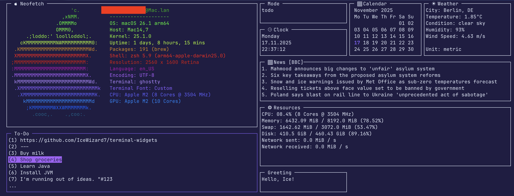

<br/>
<div align="center">
  <h3 align="center">🖥 Terminal Widgets</h3>

  <p align="center">
    This tool lets you design and run dynamic, customizable dashboards directly inside your terminal.
    It combines modular widgets, real-time data updates, and flexible layout management for a highly
    interactive CLI experience.
    <br />
    <br />
    <a href="https://www.github.com/IceWizard7/terminal-widgets/#-1-getting-started">Getting started</a> •
    <a href="https://www.github.com/IceWizard7/terminal-widgets#-2-configuration">Configuration</a> •
    <a href="https://www.github.com/IceWizard7/terminal-widgets#-3-adding-new-widgets">Adding new widgets</a> •
    <a href="https://www.github.com/IceWizard7/terminal-widgets#-4-license">License</a>
  </p>
</div>



<p>
    
    
    
    
    
</p>

---

### 🚀 **1. Getting started**

#### Installation from PyPI

1. Install: `pip install twidgets`
2. Initialize: `twidgets init`
3. Run: `twidgets`
> ⚠️ Requires Python Version 3.10+

#### Installation from Source
1. Clone this repository
2. Install dependencies: `pip install -r requirements.txt`
3. Initialize configuration: `python -m twidgets init`
4. Run: `python -m twidgets`
> ⚠️ Requires Python Version 3.10+

For full documentation see [Setup Guide](https://github.com/IceWizard7/terminal-widgets/blob/main/docs/setup_guide.md)

---

### ✨ **2. Configuration**

2.1 Changing standard colors and configuration in `~/.config/twidgets/base.yaml`

If you remove anything or let anything blank, it will just fall back to the standard configuration. \
However, you will get warned.

Example:
```yaml
use_standard_terminal_background: False

background_color:
  r: 31  # Red value
  g: 29  # Green value
  b: 67  # Blue value
  
...
```

2.2 Configure your secrets in: `~/.config/twidgets/secrets.env`

Example:
```dotenv
WEATHER_API_KEY='your_api_key'
WEATHER_CITY='Berlin,DE'
WEATHER_UNITS='metric'
NEWS_FEED_URL='https://feeds.bbci.co.uk/news/rss.xml?edition=uk'
NEWS_FEED_NAME='BCC'
```

2.3 Adjust widgets and layouts in: `~/.config/twidgets/widgets/*.yaml`

Example:
```yaml
name: 'clock'
title: ' ⏲ Clock'
enabled: True
interval: 1
height: 5
width: 30
y: 4
x: 87

weekday_format: '%A'  # day of the week
date_format: '%d.%m.%Y'  # us: '%m.%d.%Y', international: '%Y-%m-%d'
time_format: '%H:%M:%S'  # time
```

For full documentation see [Configuration Guide](https://github.com/IceWizard7/terminal-widgets/blob/main/docs/configuration_guide.md)

---

### ⭐ **3. Adding new widgets**
Adding a new widget to `terminal-widgets` is very easy—just create two files!
For a simple, static content widget, you only need to define a configuration and a single Python function.

#### 3.1. ⚙️ Define Configuration (`.yaml`)

Create the configuration file at `~/.config/twidgets/widgets/custom.yaml` and set `interval = 0` for simple widgets:

```yaml
name: custom
title: My Custom Widget
enabled: true
interval: 0 # For static content
height: 7
width: 30
y: 1
x: 1
```

#### 3.2. 🐍 Write the Widget Logic (`.py`)
> **Note:** Make sure to name the `.yaml` and `.py` files the same way (excluding suffixes)

Create the widget's Python file at `~/.config/twidgets/py_widgets/custom_widget.py`

For a simple widget, you primarily need to define the `draw` function and use `add_widget_content`

Example:

```python
from twidgets.core.base import Widget, draw_widget, add_widget_content, Config, UIState, BaseConfig
import typing

# 1. Define the draw function for content
def draw(widget: Widget, ui_state: UIState, base_config: BaseConfig) -> None:
    # Initialize the widget title, borders, etc.
    draw_widget(widget, ui_state, base_config)

    # Add your content (list of strings)
    content: list[str] = [
        'Welcome to my new widget!',
        'This is a test.',
        'It was very easy to create.'
    ]
    add_widget_content(widget, content)

# 2. Define the build function
def build(stdscr: typing.Any, config: Config) -> Widget:
    return Widget(
        config.name, config.title, config, draw, config.interval, config.dimensions, stdscr,
        update_func=None,
        mouse_click_func=None,
        keyboard_func=None
    )
```

For full documentation see [Widget Guide](https://github.com/IceWizard7/terminal-widgets/blob/main/docs/widget_guide.md)

---

### 📜 **4. License**

See [License](https://github.com/IceWizard7/terminal-widgets/blob/main/LICENSE)
